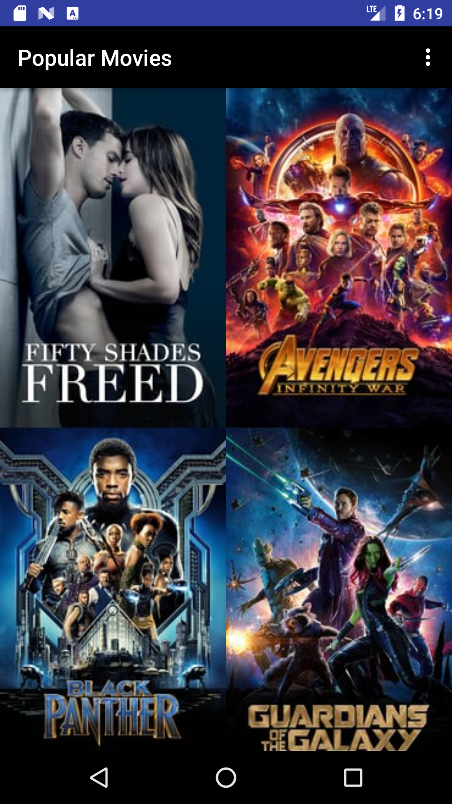
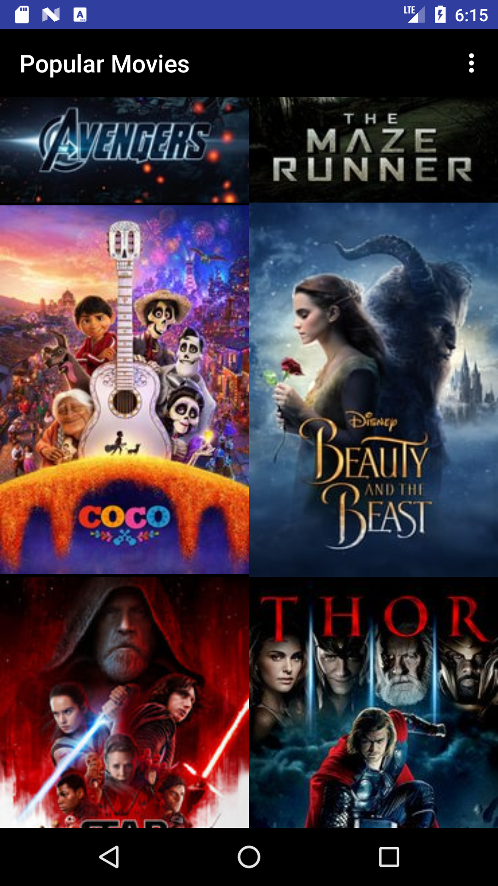
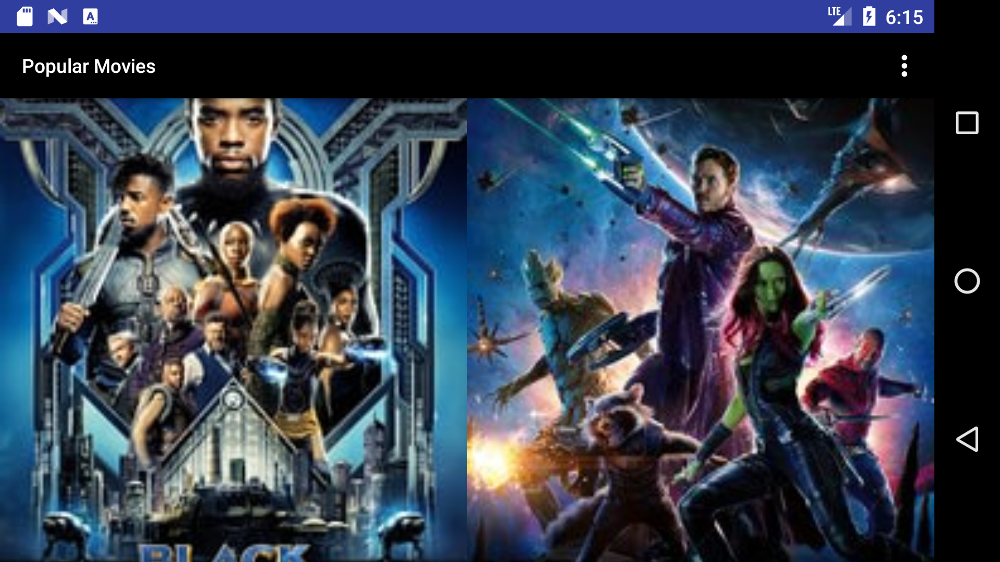
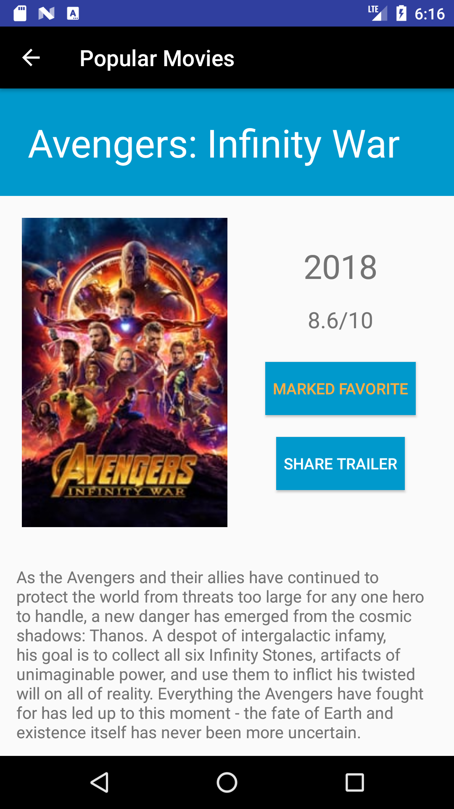
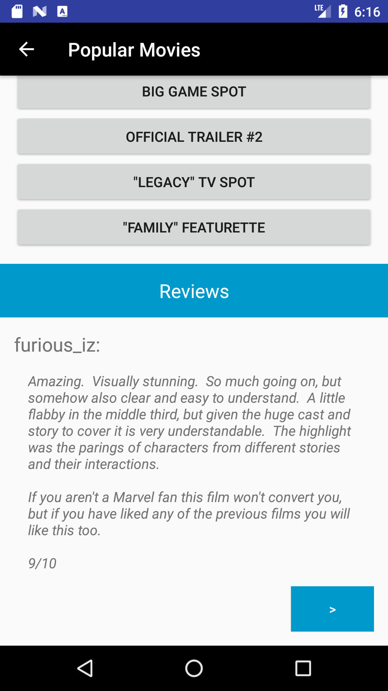
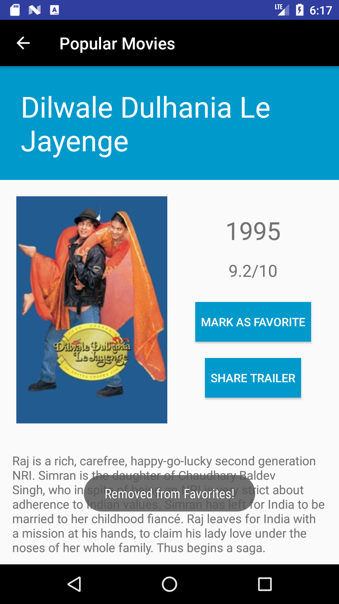
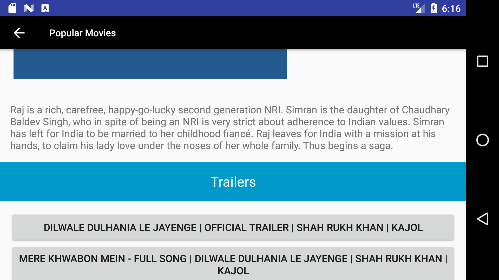

# Popular Movies
Android Developer Nanodegree project that shows users popular movies

## API Notes
Since this application uses a RESTful API to retrieve movie data, an API key is required to query The Movie DB. For privacy and Terms of Service reasons, the API key has been removed from this public repo. To run and review the application, you can register for an API key by signing up for an account at https://www.themoviedb.org/account/signup

## App Features
* View movies sorted by either "Most Popular" or "Highest Rated"
* Mark movies as favorited, to be viewed under a collection of favorites
* Watch and share movie trailers from YouTube
* Read user reviews for each movie

## Concepts Applied
* REST calls to The Movie DB API
* JSON data parsing
* Implicit Intents to launch the YouTube app
* ContentProviders for storing and retrieving SQLite data
* Saving application state via onSaveInstanceState and onRestoreInstanceState

## Screenshots

